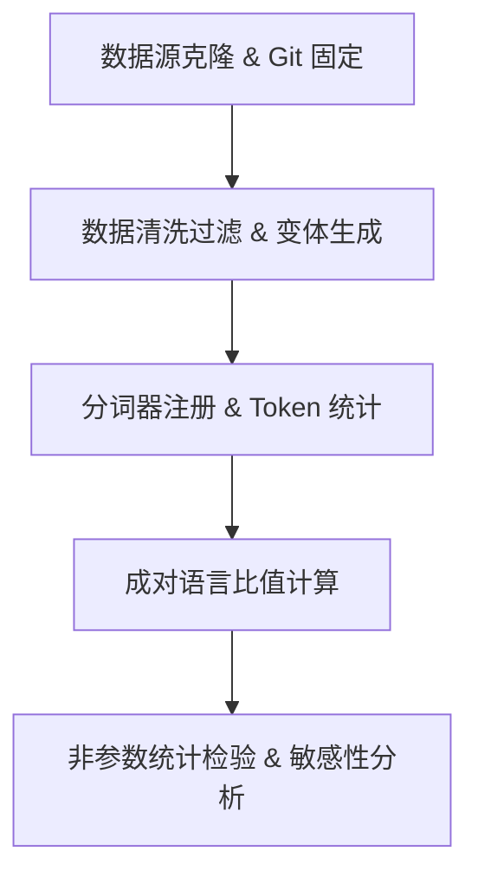

# 研究方法论 (Methodology)

## 1. 核心流程架构

本项目包含五个核心流动阶段：

## 2. 数据对齐与功能等价

功能等价性的对比是本研究有效性的基石。我们采取以下策略确保比较的公平：

1. **严格交集法则 (Strict Intersection)**：主分析仅纳入在全部 core required 语言中均有对应实现的 Rosetta Code 任务。
2. **第一实现优先**：若某种语言在同一任务中提供了多个备选实现，默认选择索引为 `0` 的主实现以防样本人为膨胀。
3. **敏感性验证**：在敏感性分析中，单独测试“仅包含单实现任务组”的子集，从而校验多实现带来的偏差。

## 3. 分词器选择与配置

为了保证实验覆盖业界主流 LLM，我们注册了以下分词器：

- **cl100k_base**：GPT-4、GPT-3.5 默认使用的 Tiktoken 编码。
- **o200k_base**：GPT-4o 采用的最新扩展编码。

所有分词过程采用本地二进制 Tiktoken 库执行，确保无网络请求延迟，且可被版本管理（`uv.lock`）完美追溯。

## 4. 统计检验设计

为处理多峰分布及极值影响，我们拒绝使用单纯的样本平均数，采用以下非参数检验：

1. **中位数比例及其 95% 置信区间 (Bootstrap CI)**：以 1000 次自助抽样生成中位数比例的置信分布。
2. **Wilcoxon 符号秩检验**：用于检验成对样本（如同一任务下 C vs Python）的差异是否在统计上显著。
3. **Cliff's Delta 效应量**：评估差异在实际应用中的大小（大、中、小或忽略）。
